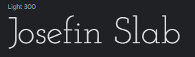

Karma Yoga is an e-commerce web application developed as part of 
[*Code Institute, Diploma in Full Stack Software Development*](https://codeinstitute.net/full-stack-software-development-diploma/).
It is the final milestone project in a series of four projects.

The live site can be accessed [*here*](INSERT HERE).

*Please note: To open any links in this document in a new browser tab, please press `CTRL + Click`.*

## Table of Contents
1. [Strategic Purpose Overview](#strategic-purpose-overview)
    * [Design Simulation](#design-simulation)
2. [User Experience Design](#user-experience-design)
   * [User Stories](#user-stories)
    *  [Design](#design)
        * [Scope and Structure](#scope-and-structure)
        * [Wireframes](#Wireframes)
        * [Database Structure](#database-structure)
        * [Security](#security)
        * [Color Scheme](#color-scheme)
        * [Typography](#typography)
        * [Imagery](#imagery)
3. [Features](#features)
    * [Existing Features](#existing-features)
    * [Future Features](#future-features)
4. [Technologies](#technologies)
    * [Languages](#languages)
    * [Frameworks and Libraries](#frameworks-and-libraries)
    * [Programmes and Tools](#Programmes-and-tools)
    * [Sources](#sources)
5. [Testing](#testing)
    * [Code Validity](#code-validity)
    * [Testing Premise](#testing-premise)
    * [Functionality](#functionality)
    * [Bugs and Fixes](#bugs-and-fixes)
    * [Final Comments](#final-comments)
6. [Deployment](#deployment)
    * [Deployment via Heroku](#deployment-via-heroku)
    * [Make a clone on GitPod](#make-a-clone-on-gitpod) 
7. [Credits](#credits)
    * [Images](#Images)
    * [Code](#Code)
    * [Content](#Content)
    * [Acknowledgements](#Acknowledgements)
## Strategic Purpose Overview

Karma Yoga is a full stack e-commerce web application for a theoretical yoga studio. The site as well as being an informative marketing tool, also facilitates the sale of class passes and yoga equipment available at the studio. Consumers will be able to purchase class passes to allow them entry to class or purchase equipment they may require for their yoga practice. Registered users will be able to save, update and delete their information and view past orders on a profile, as well as save their favourite products/passes for ease of access in the future. The site will also facilitate a means of contact to the studio via a contact form. The administrator will be able to update, edit and delete products from the frontend and monitor orders and users information from the backend.

Karma Yoga is a fully responsive data driven application using HTML, CSS, JavaScript, Python, Django Frameworks, a Postgres relational database and Stripe Payment technology. The user interface is based on the principles of good UX design. The application is cloud hosted via AWS and Heroku.

### Design Simulation

A simulation of the website on desktop and mobile devices can be seen below.

 The live site can be accessed [*here*]().

*Please note: To open any links in this document in a new browser tab, please press `CTRL + Click`.*

## User Experience Design

### User Stories

#### Anonoumous Consumer

| **As an anonoumous consumer I would like to ** : |  **So that I can**  : |
| ------------- |:-------------:|
| easily understand the main purpose of the site | determine if it is what I need |
| use an aesthetically pleasing site| enjoy my user experience |
| easily navigate the site| quickly find what I need |
| find information is clearly presented | absorb it with minimal effort |
| view the site on different screen sizes| use it on a desktop or on the go |
| view/search products and class passes | find items quickly |
| purchase products/class passes online | save time & travel expense |
| contact the studio on their site | enquire without opening a secondary platform |
| recieve feedback for my actions | to determine whether they were successfull |

#### Registered Consumer

A registered users goals are in addition to the above mentioned user goals.

| **As a registered consumer I would like to ** : |  **So that I can**  : |
| ------------- |:-------------:|
| save my information to a profile | use it again easily |
| recieve an email confirmation of my registration | verify succesful registration |
| easily login and logout | to keep my info secure |
| reset a lost password | recover access to y account |
| edit/delete my profile | manage my information |
| view past orders | keep track of them |
| be able to favourite items to my profile | access them easily for re-purchase or review |

#### Business Objective / Admin User

| **As an admin user I would like to ** : |  **So that I can**  : |
| ------------- |:-------------:|
|  have an informative web application | use it as a marketing tool |
|  sell products and class passes | generate revenue |
|  have a record of user/student information | use it for marketing and other business purposes |
|  have a contact form on the app | manage enquiries via email only |
|  upload, edit and delete products through the frontend | manage stock and product/service offering over time |

## Design

### Scope and Structure

**Scope**

* Responsive Design 
* Informative Landing Page
* Sticky top Nav Bar & Mobile Nav Bar 
* Relational database to store all uploaded data/content
* CRUD functionality for profiles and products
* Authentication functionality
* Profile page
* Search functionality
* Contact functionality
* E-Commerce functionality

**Skeleton Structure**

This application will be made up of 11 "pages" derived or based around 4 data models, product/class pass, user profile, contact form and favourites.

The landing page will consist of a large hero image with a text introduction of the site's offering or purpose.

Login, registration, add/edit products/profile and contact pages will all consist of forms with varying inputs dependant on the purpose of the form.

The profile page will display user information derived from the form, past orders and favourite products/class passes with options to edit or delete all information or favourites.

The products page will display all products/class passes and be searchable.

The product detail page will display the image and details with an option to purchase or update/delete for the admin user.

**Interaction Design**

The nav bar items will highlight on hover.

The user will be able to interact with the data on the application via the search bar, products will display below the search bar if found or a message with an error if not found.

All forms will validate and change colour/display messages to notify the user of errors.

Successful actions and unsuccessful actions will be flagged with django messages to the user.

### Wireframes
A mock-up of how the site will be laid out is available here via [Wire Frames](read-me/karma-yoga-wireframes.pdf).

### Database Structure

TBC

### Security

Sensitive data such as SECRET_KEYS were stored on heroku using config variables to prevent unwanted connections to the database.

Django allauth was used to set up user authentication and built in decorators allowed restricted access to certain features on the website.

### Color Scheme

The above color swatch shows a guideline for the color scheme of the site.

Colors are brand colours that have been adopted for their strong visual contrast in an attempt to make all content as easily consumable and suitable for visually impared users as possible.

### Typography

The Josefin Slab font, created by *Santiago Orozco* for [Google Fonts](https://fonts.google.com/specimen/Josefin+Slab?query=josefin&preview.text=Josefin%20Slab&preview.text_type=custom#about) will be the main font for all content.  

### Imagery

The hero image was used as a basis for the color theme.

The logo and class passes were created using [canva.com](https://www.canva.com/).

Product images are from [alibaba.com](https://www.alibaba.com/).

For a detailed list of photographic image sources please see the [credits](#credits) section.

## Features

### Existing Features

1. Responsive to different screen sizes.
2. Supported by Chrome, Microsoft Edge, and Firefox browsers.
3. Adapted for users with special accessibility requirements where possible.
4. There will be 14 pages: Landing page, all products page, categorized product page, product detail page, shopping bag, checkout page, successfull check out page, profile page, login page, sign up page, delete/edit product page, contact form page, 404 error and 500 error page.

        - Each page will have a navigation header
        - Each page will have a footer
        - Each page will have a favicon on the browser tab

5. Each page will have a 'sticky' navbar

        - White with black text or the reverse
        - Text logo on the left, or removed on smaller screens
        - a central search bar
        - Menu options in the center or to the left on mobile
        - The logo will route back to the home page
        - Menu options will change to color on hover & envoke a pointer
        - On mobile devices, the menu items will switch to a toggle button and slide down the page when button is clicked
        - The mobile nav will not have 'on-hover' styling
        - Anon users will see my account(signup/register), search bar, shopping cart total, all products, contact page, equipment and classes page 
        - Registered users will see the above mentioned with an additional profile tab and log out option under the 'my account' nav item

 6. The home page will have:

        - A hero image.
        - Informative text

7. The login/register page will have:

        - A form requesting user information (name, username & password) and a submission button

8. The profile page will have: 

        - An area displaying the users information
        - An area displaying orders the user has purchased
        - There will be an option to edit/delete information
        - A favourites section

9. The all products page will have:

        - A sort by category bar
        - A section displaying existing products and class passes
        - Each product will have an image, label, favourite icon and a link to review its details
        - To an admin user there will be a link to edit/delete

10. The product detail page will have:

        - An image of the product
        - Descriptive text
        - Price
        - Favourite icon
        - Quantity selector
        - Add to cart button
        - Go back button
        - Edit/Delete link for the admin user only
        - Messages displaying successfull addition of products to the shopping bag

11. The shopping bag page will have:

        - Images and descriptions of products
        - Option to edit quantity or remove products, with messages conveying these actions
        - Grand total calculation
        - Keep shopping button
        - Continue to checkout button

12. The check out page will have:

        - A form requesting order details
        - An order summary
        - A stripe payment option
        - A check box to save info to a profile
        - A grand total
        - Messages to convey successful or unsuccessful check out

14. The categorized product page will have the same features as the 'all product page' but will be pre filtered to that specific category.

15. The contact form page will have a form with fields for:

        - Name
        - Email
        - Drop down for book a class, gen enquiry or my orders
        - Text box

16. All users interactions will either be confirmed or notified of an error eith via on screen messages, orders and profile set up will be also confirmed via email.
### Future Features

Future features will include:

>   * An online booking system
>   * A chat forum for members of workshops or training courses at the studio

## Technologies

 ### Languages

 - [HTML5](https://www.w3schools.com/html/html_intro.asp) main structure of pages and templates
 - [CSS3](https://www.w3schools.com/css/css_intro.asp) for custom styling
 - [JavaScript](https://www.w3schools.com/js/js_intro.asp) for interactive elements
 - [Python](https://www.w3schools.com/python/python_intro.asp) for backend, a full list of the modules used can be found in the requirements.txt file
  ### Frameworks and Libraries

- [DJango](https://www.djangoproject.com/) functionality of the backend.
- [Bootstrap](https://getbootstrap.com/) Styling and components
- [Font Awesome](https://fontawesome.com/v4.7.0/) Used for icons
- [Google Fonts](https://fonts.google.com/) Used to import fonts.
- [Hover CSS](https://ianlunn.co.uk/articles/hover-css-tutorial-introduction) hover class on shop button.
- [AOS Library](https://michalsnik.github.io/aos/) home page text animation.

### Programmes and Tools

- [Balsamiq](https://balsamiq.com/) Used to create wireframes/mock-up during the planning & design process
- [Git Hub](https://github.com/about) Used to store, version control, and to share the project's code
- [Git/GitPod](https://www.gitpod.io/#:~:text=Gitpod%20is%20a%20multi%2Dservice,their%20own%20dedicated%20K8s%20deployment.) Code, build, debug and run applications    entirely in the cloud.
- [Canva](https://www.canva.com/) For the creation of the logo
- [Adobe Color Wheel](https://color.adobe.com) Image gradient feature was used to extract colors used in the logo and build a colour scheme
- [Am I Responsive](http://ami.responsivedesign.is/) Used to check responsivity of code and display the mock-up in the documentation
- [Chrome Developer Tools](https://developers.google.com/web/tools/chrome-devtools) Used to test and optimize the site
- [Random Key Gen](https://randomkeygen.com/) to great random secret keys
- [Red Ketchup](https://redketchup.io/favicon-generator) to create the favicon
- [Database Diagram](https://dbdiagram.io/) to create the database schema diagram
- [Heroku](https://dashboard.heroku.com/) cloud based hosting.
- [AWS](https://aws.amazon.com/) cloud based storage.

### Sources

_General sources of information for structure functionality and styling._

- Code Institute, Full Stack Development course material.
- [CodexWorld](https://www.codexworld.com/) JS learning. 

## Testing

### Code Validity

### Testing Premise

### User Stories

### Features

### Functionality

### Bugs & Fixes

## Final Comments

## Deployment

This application was created and controlled using GitHub and GitPod workspace. 

A Code Institute template was used for the initial creation of this repository which can be found [here](https://github.com/Code-Institute-Org/gitpod-full-template).
To use this template to create a similar project simply click 'Use Template' at the top of the repository. You will be directed to name your own
repositry using this template. Once named, you can decide whether to make the 'repo' public or private, my version is public. Then select 'Create Repository'.
The 'repo' should then open and you can begin working on it by selecting the green GitPod button on the top right of the repo. The GitPod button will open your workspace.

### Deployment via Heroku

1. Go to [Heroku.com](https://id.heroku.com/login) and login or create and account.
2. Your dashboard should open and there will be a 'New' button on the top-right of the screen, select this.
3. Select 'Create New App' from the buttons drop down menu
4. Add your app name (it must be unique, lowercase with a dash used instead of spaces)
5. Select the region closest to you and click create app
6. You will then need to connect your GitHub Repository, in the deploy tab, under method, select "Connect to GitHub".
7. Connect your GitHub account, ensure the correct profile name is displayed
8. Then add your repository name, search and select the correct repository
9. Click the resources tab.
10. Under Add-ons seach for Heroku Postgres and then click on it when it appears.
11. Select Plan name Hobby Dev - Free and then click Submit Order Form.
12. To set the environment variables open the settings tab and select 'Reveal Config Vars'
13. Add the following variable keys and the values you have chosen :
    - AWS_ACCESS_KEY_ID
    - AWS_SECRET_ACCESS_KEY
    - DATABASE_URL
    - EMAIL_HOST_PASS
    - EMAIL_HOST_USER
    - SECRET_KEY
    - STRIPE_PRICE_ID
    - STRIPE_PUBLIC_KEY
    - STRIPE_SECRET_KEY
    - STRIPE_WH_SECRET
    - USE_AWS

14. Hide Con Fig Vars and reopen the deploy tab
15. Under automatic deployment enable automatic deployment
16. In manual deploy section select the branch you wish to deploy from the drop down and click deploy branch
17. This will take a few moments, once complete and option to view the live app will appear

### Make a clone on GitPod

1. Select the Repo you wish to clone in GitHub
2. Click on the code dropdown button
3. Copy the https link to your clipboard
4. Open your gitpod workspace
5. In the terminal type "git clone" and paste the copied link
6. Hit enter to create the clone
7. To install the required packages type pip install -r requirements.txt into the command line
8. To view what the code will look like in a browser from here type "python3 manage.py runserver" into the console and hit enter or replace "manage.py" with which ever you have named the app
9. A pop-up will appear stating "A service is available on Port 8080" select Open Browser

## Credits

### Images
1. Hero Image by [Concious Design](https://unsplash.com/@conscious_design)
2. Products Images from [Ali Express](https://www.aliexpress.com/w/wholesale-yoga-block.html?spm=a2g0o.home.100000001.1.87872145xNoAZC)
3. Book Images from [Book Depository](https://www.bookdepository.com/)

### Code
1. CSS rule from [GitHub Gist](https://gist.github.com/juliuscsurgo/4440047) to remove blue glow from input elements

## Acknowledgements