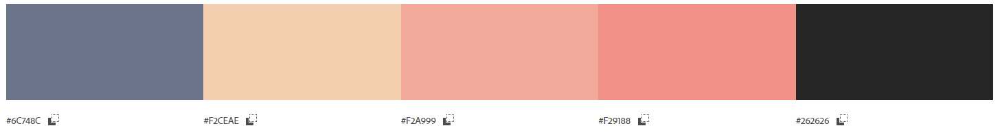
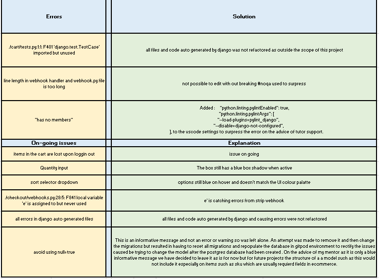

Karma Yoga is an e-commerce web application developed as part of 
[*Code Institute, Diploma in Full Stack Software Development*](https://codeinstitute.net/full-stack-software-development-diploma/).
It is the final milestone project in a series of four projects. No revenue has been generated from this site and is for project purposes only.

The live site can be accessed [*here*](https://karmayoga-ecommerce-store.herokuapp.com/).

*Please note: To open any links in this document in a new browser tab, please press `CTRL + Click`.*

## Table of Contents
1. [Strategic Purpose Overview](#strategic-purpose-overview)
    * [Design Simulation](#design-simulation)
2. [User Experience Design](#user-experience-design)
   * [User Stories](#user-stories)
    *  [Design](#design)
        * [Scope and Structure](#scope-and-structure)
        * [Wireframes](#Wireframes)
        * [Database Structure](#database-structure)
        * [Security](#security)
        * [Color Scheme](#color-scheme)
        * [Typography](#typography)
        * [Imagery](#imagery)
3. [Features](#features)
    * [Existing Features](#existing-features)
    * [Future Features](#future-features)
4. [Technologies](#technologies)
    * [Languages](#languages)
    * [Frameworks and Libraries](#frameworks-and-libraries)
    * [Programmes and Tools](#Programmes-and-tools)
    * [Sources](#sources)
5. [Testing](#testing)
    * [Code Validity](#code-validity)
    * [Testing Premise](#testing-premise)
    * [Functionality](#functionality)
    * [Bugs and Fixes](#bugs-and-fixes)
6. [Deployment](#deployment)
    * [Deployment via Heroku](#deployment-via-heroku)
    * [Make a clone on GitPod](#make-a-clone-on-gitpod) 
7. [Credits](#credits)
    * [Images](#Images)
    * [Code](#Code)
    * [Content](#Content)
    * [Acknowledgements](#Acknowledgements)
## Strategic Purpose Overview

Karma Yoga is a full stack e-commerce web application for a theoretical supplies store. The site facilitates the sale of yoga equipment and related materials. Consumers will be able to purchase items they may require for their yoga practice. Registered users will be able to save and update their personal information and view past orders on a profile, as well as save their favourite products for ease of access in the future. The site will also facilitate a means of contact of the store via a contact form. The administrator will be able to update, edit and delete products from the frontend and monitor orders and users information from the backend.

Karma Yoga is a fully responsive data driven application using HTML, CSS, JavaScript, Python, Django Frameworks, a Postgres relational database and Stripe Payment technology. The user interface is based on the principles of good UX design. The application is cloud hosted via AWS and Heroku.

### Design Simulation

A simulation of the website on desktop and mobile devices can be seen below.


 The live site can be accessed [*here*](https://karmayoga-ecommerce-store.herokuapp.com/).

*Please note: To open any links in this document in a new browser tab, please press `CTRL + Click`.*

## User Experience Design

### User Stories

#### Anonoumous Consumer

| **As an anonoumous consumer I would like to ** : |  **So that I can**  : |
| ------------- |:-------------:|
| easily understand the main purpose of the site | determine if it is what I need |
| use an aesthetically pleasing site| enjoy my user experience |
| easily navigate the site| quickly find what I need |
| find information is clearly presented | absorb it with minimal effort |
| view the site on different screen sizes| use it on a desktop or on the go |
| view/search products | find items quickly |
| purchase products online | save time & travel expense |
| contact the store on their site | enquire without opening a secondary platform |
| recieve feedback for my actions | to determine whether they were successfull |

#### Registered Consumer

A registered users goals are in addition to the above mentioned user goals.

| **As a registered consumer I would like to ** : |  **So that I can**  : |
| ------------- |:-------------:|
| save my information to a profile | use it again easily |
| recieve an email confirmation of my registration | verify succesful registration |
| easily login and logout | to keep my info secure |
| reset a lost password | recover access to my account |
| edit my profile | manage my information |
| view past orders | keep track of them |
| be able to favourite items to my profile | access them easily for re-purchase or review |

#### Business Objective / Admin User

| **As an admin user I would like to ** : |  **So that I can**  : |
| ------------- |:-------------:|
|  have an informative web application | use it as an e-commerce tool |
|  sell products | generate revenue |
|  have a record of user information | use it for marketing and other business purposes |
|  have a contact form on the app | manage enquiries via email only |
|  upload, edit and delete products through the frontend | manage stock and product/service offering over time |

## Design

### Scope and Structure

**Scope**

* Responsive Design 
* Informative Landing Page
* Sticky top Nav Bar & Mobile Nav Bar 
* Relational database to store all uploaded data/content
* CRUD functionality at varying levels for profiles and products
* Authentication functionality
* Profile page
* Search functionality
* Contact functionality
* Favourites list functionality
* E-Commerce functionality

**Skeleton Structure**

This application will be made up of multiple pages derived or based around 6 data models, product, cart, checkout, user profile, contact form and favourites.

The landing page will consist of a large hero image with a text introduction of the site's offering or purpose.

Login, registration, add/edit products/profile and contact pages will all consist of forms with varying inputs dependant on the purpose of the form.

The profile page will display user information derived from the form and past orders .

The favourite products page will display favourited items with options to remove them or view the product in detail.

The products page will display all products and can be sorted or filtered.

The product detail page will display the image and details with an option to purchase, favourite or update/delete for the admin user.

**Interaction Design**

The nav bar items will highlight on hover.

The user will be able to interact with the data on the application via the search bar, products will display below the search bar if found or a line of text with '0 products found' if not found. They can also filter and sort categories using a sort selector drop down.

All forms will validate and change colour/display messages to notify the user of errors.

Delete features will trigger warning modals and require confirmation before the action runs.

Successful actions and unsuccessful actions will be flagged with django messages to the user.

Authentication processes, placed orders and contact form submission will trigger emails sent to the users email address provided.

### Wireframes
A mock-up of how the site will be laid out is available here via [Wire Frames](read-me/karma-yoga-wireframes.pdf).

### Database Structure


#### Data Models

###### Product & Categories

- The product model creates objects containing individual product information, such as name, description, price, image and sku. 
- The unique ID is auto generated. 
- The product objects will be used for the order model and favourites model.
- The product model is lonked to the categories model which divides the products into subsections.

##### User Profile & User

- The User model is created by django All Auth on registration, it stores the name, email and password of a user.
- The User Profile model creates and instance of the user information in the database, similar to above as an object. 
- The User Profile is linked to the User model. 
- The user Profile stores shipping and contact information.

##### Order Model & Order Line Item

- The order model is connected to the user profile, feeding in the shipping and contact information. 
- The order model creates an instance of an order on the data base with billing information, date and time of placement and by whom. 
- The order model is linked to the Order Line Item model which holds the product information for the order placed.
- The Order Line Item model is linked to products.

##### Favourites and Favourited Items
- The favourites creates a 'container' for users to store favourited products. 
- The favourited items model creates instances of these favourite products in the container.
- This model is linked to the user and to the poduct model.

##### Contact
- The contact model stores users queries in the backend for the admin user to view.

### Security

Sensitive data such as SECRET_KEYS were stored on heroku using config variables to prevent unwanted connections to the database.

Django allauth was used to set up user authentication and built in decorators allowed restricted access to certain features on the website.

### Color Scheme



The above color swatch shows a guideline for the color scheme of the site.

Colors are brand colours that have been adopted for their strong visual contrast in an attempt to make all content as easily consumable and suitable for visually impared users as possible.

### Typography

The Josefin Slab font, created by *Santiago Orozco* for [Google Fonts](https://fonts.google.com/specimen/Josefin+Slab?query=josefin&preview.text=Josefin%20Slab&preview.text_type=custom#about) will be the main font for all content.  


### Imagery

The hero image was used as a basis for the color theme.

The logo and class passes were created using [canva.com](https://www.canva.com/).

Product images are from [alibaba.com](https://www.alibaba.com/).

For a detailed list of photographic image sources please see the [credits](#credits) section.


## Features

### Existing Features

1. Responsive to different screen sizes.
2. Supported by Chrome, Opera, and Firefox browsers.
3. Adapted for users with special accessibility requirements where possible.
4. There will be multiple pages: Landing page, all products page, product detail page, shopping bag, checkout page, successfull check out page, profile page, login page, sign up page, delete/edit product page, contact form page, favourites page, 404 error and 500 error page.

        - Each page will have a navigation header
        - Each page will have a footer
        - Each page will have a favicon on the browser tab

5. Each page will have a 'sticky' navbar

        - High contrast between text and background.
        - Text logo on the left, or removed on smaller screens
        - A central search bar
        - Menu options in the center or to the left on mobile
        - The logo will route back to the home page
        - Menu options will change to color on hover & envoke a pointer
        - On mobile devices, the menu items will switch to a toggle button and slide down the page when button is clicked
        - The mobile nav will not have 'on-hover' styling
        - Anon users will see my account(signup/register), search bar, shopping cart total, all products, contact page, equipment and classes page 
        - Registered users will see the above mentioned with an additional profile tab and log out option under the 'my account' nav item

 6. The home page will have:

        - A hero image.
        - Informative text

7. The login/register page will have:

        - A form requesting user information (name, username & password) and a submission button
        - Toast messages displaying successfull/unsuccessfulsubmission of information

8. The profile page will have: 

        - An area displaying the users information
        - An area displaying orders the user has purchased
        - There will be an option to edit information
        - Toast messages displaying successfull/unsuccessful update of information

9. The all products page will have:

        - A sort by category bar
        - A section displaying existing products
        - Each product will have an image, label and a link to review its details
        - To an admin user there will be a link to edit/delete

10. The product detail page will have:

        - An image of the product
        - Descriptive text
        - Price
        - Favourite icon
        - Quantity selector
        - Add to cart button
        - Go back button
        - Edit/Delete link for the admin user only
        - Toast messages displaying successfull/unsuccessful addition of products to the shopping bag

11. The shopping bag page will have:

        - Images and descriptions of products
        - Option to edit quantity or remove products
        - Grand total calculation
        - Keep shopping button
        - Continue to checkout button
        - Toast messages displaying successfull/unsuccessful removal of products

12. The check out page will have:

        - A form requesting/prepopulating order details
        - An order summary
        - A stripe payment option
        - A check box to save info to a profile
        - A grand total
        - Messages to convey successful or unsuccessful check out

14. The favourites page will have:

        - Has cards displaying favourited items that link to product detail view.
        - Heart icons on the cards that allow removal.
        - If emptry a navigation button to the all products page.
        - Toast messages to convey successful or unsuccessful removal of items.

15. The contact form page will have a form with fields for:

        - Name
        - Email
        - Drop down menu for the subject title
        - Text box
        - Submission button
        - Toast messages to convey successful or unsuccessful submission of the form.

16. All users interactions will either be confirmed or notified of an error either via on screen messages, orders, contact forms and profile set up will be also confirmed via email.

17. All products page and the cart page will have a scroll to top button.
### Future Features

Future features will include:

>   * A subscription feature to view/ access online classes and workshops
>   * A chat forum for members of workshops, classes or training courses.

## Technologies

 ### Languages

 - [HTML5](https://www.w3schools.com/html/html_intro.asp) main structure of pages and templates
 - [CSS3](https://www.w3schools.com/css/css_intro.asp) for custom styling
 - [JavaScript](https://www.w3schools.com/js/js_intro.asp) for interactive elements
 - [Python](https://www.w3schools.com/python/python_intro.asp) for backend, a full list of the modules used can be found in the requirements.txt file
The below python modules were used and are fundamental to the project
```
asgiref==3.4.1
boto3==1.18.36
botocore==1.21.36
dj-database-url==0.5.0
Django==3.2.6
django-allauth==0.45.0
django-countries==7.2.1
django-crispy-forms==1.12.0
django-storages==1.11.1
gunicorn==20.1.0
jmespath==0.10.0
oauthlib==3.1.1
Pillow==8.3.1
psycopg2-binary==2.9.1
PyJWT==2.1.0
pylint-django==2.4.4
pylint-plugin-utils==0.6
python3-openid==3.2.0
pytz==2021.1
requests-oauthlib==1.3.0
s3transfer==0.5.0
sqlparse==0.4.1
stripe==2.60.0
```
  ### Frameworks and Libraries

- [DJango](https://www.djangoproject.com/) functionality of the backend.
- [Bootstrap](https://getbootstrap.com/) Styling and components
- [Font Awesome](https://fontawesome.com/v4.7.0/) Used for icons
- [Google Fonts](https://fonts.google.com/) Used to import fonts.
- [Hover CSS](https://ianlunn.co.uk/articles/hover-css-tutorial-introduction) hover class on shop button.
- [AOS Library](https://michalsnik.github.io/aos/) home page text animation.

### Programmes and Tools

- [Balsamiq](https://balsamiq.com/) Used to create wireframes/mock-up during the planning & design process
- [Git Hub](https://github.com/about) Used to store, version control, and to share the project's code
- [Git/GitPod](https://www.gitpod.io/#:~:text=Gitpod%20is%20a%20multi%2Dservice,their%20own%20dedicated%20K8s%20deployment.) Code, build, debug and run applications    entirely in the cloud.
- [Canva](https://www.canva.com/) For the creation of the logo
- [Adobe Color Wheel](https://color.adobe.com) Image gradient feature was used to extract colors used in the logo and build a colour scheme
- [Techsini](http://techsini.com/multi-mockup/index.php) Used to check responsivity of code and display the mock-up in the documentation
- [Chrome Developer Tools](https://developers.google.com/web/tools/chrome-devtools) Used to test and optimize the site
- [Random Key Gen](https://randomkeygen.com/) to great random secret keys
- [Red Ketchup](https://redketchup.io/favicon-generator) to create the favicon
- [Database Diagram](https://dbdiagram.io/) to create the database schema diagram
- [Heroku](https://dashboard.heroku.com/) cloud based hosting and heroku postgres database.
- [AWS](https://aws.amazon.com/) cloud based storage.

### Sources

_General sources of information for structure functionality and styling._

- Code Institute, Full Stack Development course material, slack community and tutor support.
- [CodexWorld](https://www.codexworld.com/) JS learning. 
- [Django Documentation](https://docs.djangoproject.com/en/3.2/)
- [Stripe Documentation](https://stripe.com/docs).
- [Stack OverFlow](https://stackoverflow.com/).


## Testing

A full testing report can be found [here](testing/testing.xlsx)

To test the payments functionality of the site you will need the below test credit card numbers from the [Stripe Documentation](https://stripe.com/docs/testing):

>* Number: 4242 4242 4242 4242  
>* Exp. Date: Anything (e.g. 02/24) CVC: Anything (e.g. 007)
### Code Validity 
The syntax and validity of the HTML and JavaScript code used were passed through the two validators mentioned below and passed all tests without errors.

- [W3C](https://www.validator.w3.org/)
- [JS Hint](https://jshint.com/)
- [W3c Jigsaw](https://jigsaw.w3.org/css-validator/)

The python was run with pylint in the terminal. Errors were ammended to bring the score to 9.09. On going error explanations can be found in the testing document linked above.
Python code is PeP8 compliant.


### Testing Premise
The entire site was tested under the three premises of :

>* User Stories
>* Business Objective
>* Features
>* Functionality - CRUD, Error Handeling, Security

Testing was done on three browsers; Chome v93 , Opera 78 and FireFox v91 on the below screen sizes:

**Chrome & Opera**
>* Moto G4 (640 x 360)
>* Galaxy S5 (360 x 640)
>* Pixel 2 (411 x 731)
>* Pixel 2 XL (411 x 823)
>* iPhone 5/SE (320 x 568)
>* iPhone 6/7/8 (375 x 667)
>* iPhone 6/7/8 Plus (414 x 736)
>* iPhone X (375 x 812)
>* iPad (768 x 1024)
>* Surface Duo (540 x 720)
>* Galaxy Fold (280 x 653)
>* Laptop (1440 x 900)

**Mozilla Fire Fox**

>* Galaxy Note 3 (360 x 640)
>* Galaxy Note 9 (414 x 846)
>* Galaxy S5 (360 x 640)
>* Galaxy S9 (360 x 740)
>* iPad (768 x 1024)
>* iPhone 5/SE (320 x 568)
>* iPhone 6/7/8 (375 x 667)
>* iPhone 6/7/8 Plus (414 x 736)
>* iPhone X/XS (375 x 812)
>* iPhone XR (414 x 896)
>* Laptop (1440 x 900)

Testing was documented using Microsoft Excel and the full spreadsheet can be found [here](testing/testing.xlsx). 
Bugs found in the code and their fixes can also be found in the Excel document.

The live site was also analysed using Google Developer Tools Lighthouse feature which it scored high for performance, accessibility, and SEO. Best practices also rates highly but was compromised by using third party JavaScript libraries.


### User Stories


### Features


### Functionality


### Bugs & Fixes




## Deployment

This application was created and controlled using GitHub and GitPod workspace. 

A Code Institute template was used for the initial creation of this repository which can be found [here](https://github.com/Code-Institute-Org/gitpod-full-template).
To use this template to create a similar project simply click 'Use Template' at the top of the repository. You will be directed to name your own
repositry using this template. Once named, you can decide whether to make the 'repo' public or private, my version is public. Then select 'Create Repository'.
The 'repo' should then open and you can begin working on it by selecting the green GitPod button on the top right of the repo. The GitPod button will open your workspace.

### Deployment via Heroku

1. Go to [Heroku.com](https://id.heroku.com/login) and login or create and account.
2. Your dashboard should open and there will be a 'New' button on the top-right of the screen, select this.
3. Select 'Create New App' from the buttons drop down menu
4. Add your app name (it must be unique, lowercase with a dash used instead of spaces)
5. Select the region closest to you and click create app
6. Install 'dj_database_url' and 'psycopg2' via the CLI using the pip3 install prefixed to the module names
>* pip3 install dj_database_url
>* pip3 install psycopg2
7. Login to Heroku via the CLI 
>* 'heoku login -i'
8. Run migration on the Heroku Postgres -
>* 'heroku run python manage.py migrate'
9. Create a new super user for this deployed version 
10. Install 'gunicorn' and then freeze to your requirments.txt
11. Create the 'Procfile' note the capital 'P' and add :

>* web: gunicorn `your-app-name`.wsgi:application

12. Disable Heroku from collecting static files - 
>* 'heroku config:set DISABLE_COLLECTSTATIC=1 --app `your-app-name`
13. Add the host name to your settings.py file, under ALLOWED_HOSTS
>* ALLOWED_HOSTS = ['`you-app-name`.herokuapp.com', 'localhost']
14. To set the environment variables open the settings tab and select 'Reveal Config Vars'
15. Add the following variable keys and the values you have chosen :
    - AWS_ACCESS_KEY_ID
    - AWS_SECRET_ACCESS_KEY
    - DATABASE_URL
    - DISABLE_COLLECT_STATIC = 1
    - EMAIL_HOST_PASS
    - EMAIL_HOST_USER
    - SECRET_KEY
    - STRIPE_PRICE_ID
    - STRIPE_PUBLIC_KEY
    - STRIPE_SECRET_KEY
    - STRIPE_WH_SECRET
    - USE_AWS = True

16. Hide Con Fig Vars and reopen the deploy tab
17. Add an commit your changes in the CLI, then use the below to to deploy to Heroku :
>* git push Heroku master
18. You will then need to connect your GitHub Repository, in the deploy tab, under method, select "Connect to GitHub". Connect your GitHub account, ensure the correct profile name is displayed. Then add your repository name, search and select the correct repository.
19. Under automatic deployment, enable automatic deployment.
20. You can now deploy via the heroku dashboard by clicking the `open app` button. At this stage your site have deployed with out any static files.

### AWS S3 Bucket 
1. Create your AWS account
2. Search for S3 and create a new bucket, select 'allow public access'
3. Under Properties go to static website hosting. Select enable typle index.html as index.html and save.
4. In Permissions, under CORS use :
>* [
  {
      "AllowedHeaders": [
          "Authorization"
      ],
      "AllowedMethods": [
          "GET"
      ],
      "AllowedOrigins": [
          "*"
      ],
      "ExposeHeaders": []
  }
]
5. Still in permissions, select bucket policy:
>* Generate bucket policy and copy the bucket ARN
>* Choose S3 Bucket Policy as type of policy
>* For Principle enter *
>* Paste ARN copied from above
>* Add Statement
>* Generate Policy
>* Copy Policy JSON Document
>* Paste policy into Edit Bucket policy on the previous tab
>* Save 
6. Under Access Control List (ACL):
>* For Everyone (public access), tick List
>* Accept that everyone in the world may access the Bucket
>* Save

### AWS IAM
1. From the IAM dashboard within AWS, select User Groups:
>* Create a new group
>* Click through and create group
2. Select Policies:
>* Create policy
>* Under JSON tab, click Import managed policy
>* Choose AmazongS3FullAccess
>* Edit the resource to include the Bucket ARN noted earlier when creating the Bucket Policy
>* Click next step and go to Review policy
>* Give the policy a name and description of your choice
>* Create policy
3. Go back to User Groups and choose the group created earlier
>* Under Permissions > Add permissions, choose Attach Policies and select the one just created
>* Add permissions
4. Under Users::
>* Choose a user name
>* Selecet programmatic access as the access type
>* Click through next
>* Add the user to the group just created
>* Click next and creat user
5. Download the ``.csv` containing the access key and secret access key.
>* The `.csv` file is onlu available once and cannot be downloaded again

### Connecting Heroku to AWS S3
1. Install boto3 and django-storages and freeze your requirements
2. Add the values from the `.csv` you downloaded to the Heroku configvars
3. Delete 'DISABLE_COLLECT_STATIC = 1' from the config vars
4. Create a custom storage python file in your development environment with the following

>* from django.conf import settings
>* from storages.backends.s3boto3 import S3Boto3Storage


>* class StaticStorage(S3Boto3Storage):
    location = settings.STATICFILES_LOCATION


>* class MediaStorage(S3Boto3Storage):
    location = settings.MEDIAFILES_LOCATION


5. Deploy the app
6. In the S3 bucket, set up a new media folder at the same level as the tatic folder and upload any required files. Both files need to be publicly accessible.

### Make a clone on GitPod

1. Select the Repo you wish to clone in GitHub
2. Click on the code dropdown button
3. Copy the https link to your clipboard
4. Open your gitpod workspace
5. In the terminal type "git clone" and paste the copied link
6. Hit enter to create the clone
7. To install the required packages type pip install -r requirements.txt into the command line
8. Set up an env.py and add the env.py to your gitignore file. Include:
>* import os
>* os.environ.setdefault("STRIPE_SECRET_KEY", "`ADD YOUR KEY`")
>* os.environ.setdefault("STRIPE_PUBLIC_KEY", "`ADD YOUR KEY`")
>* os.environ.setdefault("STRIPE_WH_SECRET", "`ADD YOUR KEY`")
9. add the following to your settings.py 
>* if os.path.exists("env.py"): import env
10. Apply migrations
11. Create your super user
12. To view what the code will look like in a browser from here type "python3 manage.py runserver" into the console and hit enter or replace "manage.py" with which ever you have named the app
13. A pop-up will appear stating "A service is available on Port 8080" select Open Browser

## Credits

### Images
1. Hero Image by [Concious Design](https://unsplash.com/@conscious_design)
2. Products Images from [Ali Express](https://www.aliexpress.com/w/wholesale-yoga-block.html?spm=a2g0o.home.100000001.1.87872145xNoAZC)
3. Book Images from [Book Depository](https://www.bookdepository.com/)

### Code
1. CSS rule from [GitHub Gist](https://gist.github.com/juliuscsurgo/4440047) to remove blue glow from input elements
2. Code Institute Boutique Ado Full Stack, Frameworks with Django Project.
3. Some styling for form inputs came from the CSS from [Stripe Documentation](https://stripe.com/docs).

## Acknowledgements

1. Huge thanks to **Harry Dillon** who has been a great source of advice and guidance through out the duration of this project and the diploma as a whole. Harry helped with testing and stream lining multiple parts of this project. He helped with my understanding of how models work, which ultimately helped with the creation of my two models, contact and favourites.

2. Special thanks to my mentor Rohit Sharma who is a calming presense and excellent guide who pushes for excellence always.

3. A thank you to **Daisy McGirr** for her assistance with deployment.

4. Last but not least a resounding thank you to **Jo, Johann, Sean, John, Igor and Scott** on the CI tutoring team for their assistance and unfailing good natured humour no matter the situation.